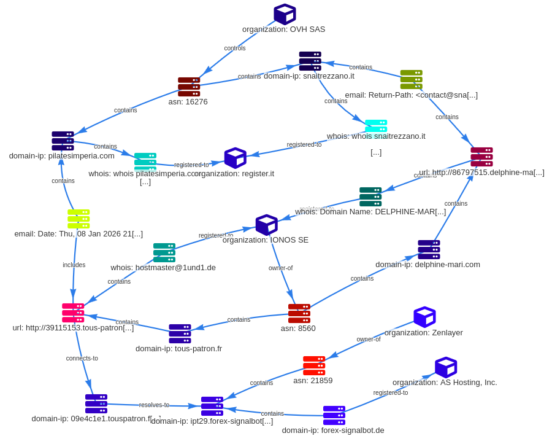
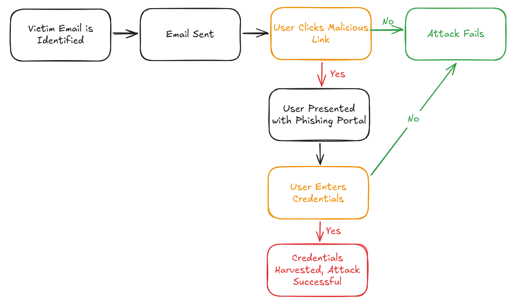
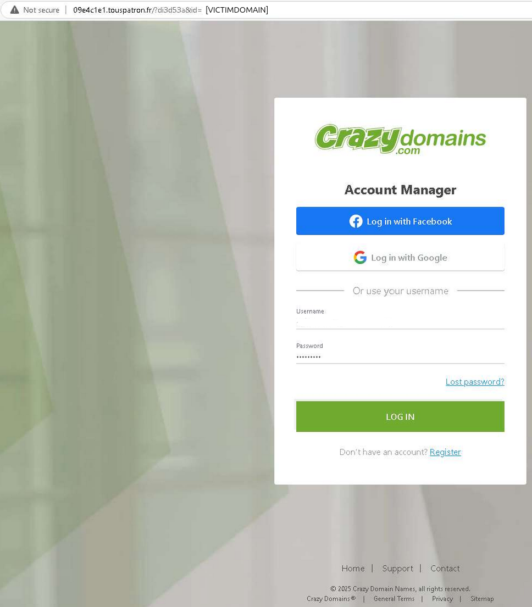
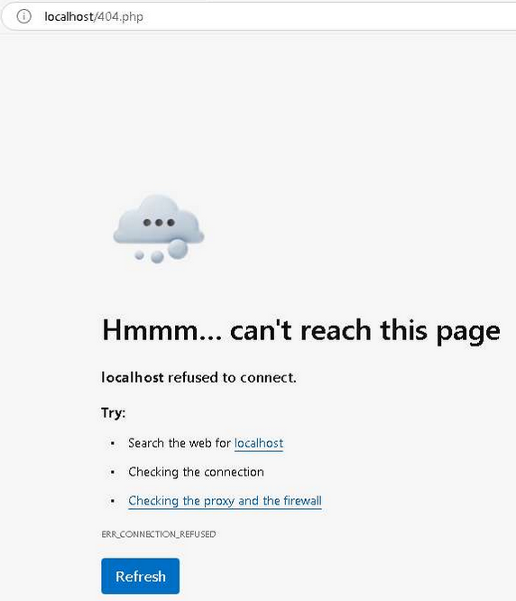

# Threat Report - Crazy Domains Phishing Campaign

**Report Metadata**

| Attribute                              | Value                                |
| -------------------------------------- | ------------------------------------ |
| **Author**                             | Andrew Wilkinson                     |
| **Published Date**                     | 2026-02-11                           |
| **Report Version**                     | v1.0                                 |
| **Report Reliability/Credibility**     | B2 (Usually Reliable, Probably True) |
| **Threat Actor Infrastructure Status** | Active as of published date          |
| **TLP**                                | Clear                                |


**Contents**

| Section                           | Page Number |
| --------------------------------- | ----------- |
| 1. Report Summary                 | 2           |
| 2. Report Purpose and Scope       | 2           |
| 3. Event Detection and Timeline   | 2           |
| ___ 3.1 Event Overview            | 2           |
| ___ 3.2 Timeline                  | 3           |
| 4. Observed Data and Correlations | 3           |
| ___ 4.1 Email Sample              | 3           |
| ___ 4.2 Infrastructure Map        | 5           |
| ___ 4.3 Attack Chain              | 6           |
| 5. Analytical Judgments           | 9           |
| ___ 5.1 Analysis Summary          | 9           |
| ___ 5.2 Analysis Detail           | 9           |
| 6. Indicators of Compromise       | 10          |
| ___ 6.1 Atomic Indicators         | 10          |
| ___ 6.2 Behavioural Indicators    | 10          |
| 7. Recommendations                | 11          |
| 8. Sources                        | 11          |
| 9. Artifacts & References         | 12          |

\newpage

# 1. Report Summary
In December 2025, a phishing email was received by the owner of a domain registered with Crazy Domains (crazydomains[.]co[.]nz). The email impersonated Crazy Domains and attempted to harvest credentials by persuading the recipient to resolve a fictitious payment issue.

A second, almost identical phishing email was received in January of 2026, using a different malicious domain. The infrastructure behind both emails has been correlated. The likelihood both emails were sent by a single threat actor, or group of affiliated threat actors, is assessed as very likely.

The DMARC record for the victim domain is public and contains a contact email, which is the same mailbox that received the phishing emails. It is likely the threat actors used this information for victim identification.

The phishing link from the first email was inactive at the time it was visited. The phishing link from the second email led to a login page impersonating Crazy Domains. The page harvested credentials entered into the page, and redirected the user to a fake 404 page.

The event was reported to Crazy Domains on 2026-02-03.


# 2. Report Purpose and Scope
Through the event analysis and compilation of this report, the Author had three goals:

1. Gather enough information for an actionable report to Crazy Domains,
2. Gather enough information for a comprehensive and actionable report to the New Zealand National Cyber Security Centre (NCSC), and
3. Take advantage of learning opportunities, specifically around data collection and use of MISP.

The scope of this report was constrained to focus on:

1. Data collection relevant to Crazy Domains and the NCSC,
2. Data clearly related to the event, and
3. Data that could be collected passively (e.g. dig, whois).

Left out of scope were:

1. Data points that were correlate-able but not clearly related to the event,
2. Any data not available from public sources, and
3. Data collection using active scanning of threat actor infrastructure.

The Author assesses the reliability and credibility of this report as B2 (Usually Reliable, Probably True) according to the Admiralty Scale:

 - External sources are assessed as B2 and B3 respectively.
 - Initial data collection was done from infrastructure controlled by the Author.


# 3. Event Detection and Timeline
### 3.1 Event Overview
TTPs are mapped to MITRE ATT&CK.
More information on infrastructure is available in the Observed Data and Correlations section.

**Adversary:** Unknown; attribution not attempted.

**Victim:** Domain Registrant Customer of Crazy Domains (crazydomains[.]co[.]nz)

**Infrastructure:**

- *IP Addresses:* OVH SAS (ASN 16276), IONOS SE (ASN 8560), Zenlayer (ASN 21859)
- *Domains:* IONOS SE (.fr, .com domains), Register.it (.it, .com domains), A2 Hosting (.de domains)
- *Web Hosting:* Zenlayer (ipt29[.]forex-signalbot[.]de), A2 Hosting (forex-signalbot[.]de)

**Capabilities/TTPs:** Credential Harvesting

- *Reconnaissance:* DNS/Passive DNS (T1596.001)
- *Initial Access:* Spearphishing Link (T1566.002)
- *Execution:* Malicious Link (T1204.001)
- *Collection:* Web Portal Capture (T1056.003)

### 3.2 Timeline

| Date (NZDT) | Event                            | Notes                                                                                                  |
| ----------- | -------------------------------- | ------------------------------------------------------------------------------------------------------ |
| 2025-12-24  | Phishing Email #1 Received       | From: contact[@]snaitrezzano[.]it                                                                          |
| 2026-01-05  | Reported to OVH SAS              | Abuse Ticket #BTWZPLXMQZ                                                                               |
| 2026-01-08  | Phishing Email #2 Received       | From: <39115153[@]pilatesimperia[.]com>                                                                    |
| 2026-02-03  | Reported to Crazy Domains        |                                                                                                        |
| 2026-02-04  | Reported to Google Safe Browsing | hxxp[://]09e4c1e1[.]touspatron[.]fr/ Reported via https://safebrowsing.google.com/safebrowsing/report_phish/ |
| 2026-02-11  | Reported to the NZ NCSC          |                                                                                                        |


# 4. Observed Data and Correlations
Full dataset is available at: 
github.com/ApthNZ/reports-portfolio/tree/main/crazydomains-phishing-2026

### 4.1 Email Sample

```{.text breaklines=true}
Date: Thu, 08 Jan 2026 21:44:11 +0100
Subject: Service Suspension Notice.
To: [VICTIMNAME] <contact@[VICTIMDOMAIN]>
From: Crazy Domains <39115153[@]pilatesimperia[.]com>

Service Suspension Notice

Dear customer,

We would like to inform you that, in accordance with our contractual terms, your service has been suspended due to a payment issue encountered during automatic renewal.

Here are the details regarding this suspension :

Domain name
Reason for suspension

[VICTIMDOMAIN]
Failed automatic renewal

To reactivate your service, we invite you to resolve your account by completing the pending payment. You can do so directly via the following link :

Reactivate your service
<hxxp[://]39115153[.]tous-patron[.]fr/?id=[VICTIMDOMAIN]>

We remain at your disposal for any further information you may require.

Best regards,
The Crazy Domains team
```

### 4.2 Infrastructure Map
The infrastructure map below was generated in MISP; STIX and MISP files are available at:
github.com/ApthNZ/reports-portfolio/tree/main/crazydomains-phishing-2026



### 4.3 Attack Chain


| Activity                                                              | Reference                                                                                                                                         |
| --------------------------------------------------------------------- | ------------------------------------------------------------------------------------------------------------------------------------------------- |
| User clicks malicious link in email                                   | hxxp[://]39115153[.]tous-patron[.]fr/?id=[VICTIMDOMAIN]                                                                                           |
| Redirect                                                              | hxxp[://]09e4c1e1[.]touspatron[.]fr/?di3d53a&id=[VICTIMDOMAIN]                                                                                    |
| User presented with phishing portal impersonating Crazy Domains login |                                                                                                               |
| User submits credentials, credentials are harvested                   | 3222 158.024929 192[.]168[.]100[.]6 → 156[.]59[.]189[.]134 HTTP 774 POST /sn[.]php?id=[VICTIMDOMAIN] HTTP/1.1  (application/x-www-form-urlencoded) |
| User is redirected to localhost/404.php                             |                                                                                                               |
```
tshark -r crazydomainsphish.pcap -Y "(http.request || http.response) && ip.addr == 156.59.189.134"
   76   6.197275 192.168.100.6 → 156.59.189.134 HTTP 521 GET /?id=[VICTIMDOMAIN] HTTP/1.1
  975  28.636042 156.59.189.134 → 192.168.100.6 HTTP 291 HTTP/1.1 302 Found
  984  28.664321 192.168.100.6 → 156.59.189.134 HTTP 528 GET /?di3d53a&id=[VICTIMDOMAIN] HTTP/1.1
 2390  55.144604 156.59.189.134 → 192.168.100.6 HTTP 1444 HTTP/1.1 200 OK  (text/html)
 2392  55.169301 192.168.100.6 → 156.59.189.134 HTTP 416 GET /jquery.js HTTP/1.1
 2506  56.019877 156.59.189.134 → 192.168.100.6 HTTP 653 HTTP/1.1 200 OK  (application/javascript)
 2530  56.121946 192.168.100.6 → 156.59.189.134 HTTP 479 GET /favicon.ico HTTP/1.1
 2538  56.151500 192.168.100.6 → 156.59.189.134 HTTP 352 GET /jquery.js HTTP/1.1
 2555  56.523716 156.59.189.134 → 192.168.100.6 HTTP 1437 HTTP/1.1 404 Not Found  (text/html)
 2828  57.344229 156.59.189.134 → 192.168.100.6 HTTP 703 HTTP/1.1 200 OK  (application/javascript)
 3222 158.024929 192.168.100.6 → 156.59.189.134 HTTP 774 POST /sn.php?id=[VICTIMDOMAIN] HTTP/1.1  (application/x-www-form-urlencoded)
 3303 180.853264 156.59.189.134 → 192.168.100.6 HTTP 262 HTTP/1.1 302 Found

```


# 5. Analytical Judgments
### 5.1 Analysis Summary

 - The DMARC record for the victim domain is public and contains a contact email, which is the same mailbox that received the phishing emails. It is likely the threat actors used this information for victim identification.
 - The likelihood both emails were sent by a single threat actor, or group of affiliated threat actors, is assessed as very likely.

### 5.2 Analysis Detail
**Reconnaissance and Victim Identification**

| Hypothesis | Evidence | Assessment |
| ------------------------------ | ------------------------------ | -------------------- |
| DNS Privacy: DNS Privacy appears not to have been enabled at the time the phishing emails were sent.                                               | The receiving email address has never been listed as a domain contact.             | Almost No Chance  |
| DMARC: DMARC record is public and contains a contact email. The attackers could have used this information for victim identification.              | The contact email for DMARC is the same mailbox that received the phishing emails. | Likely            |
| Common mailbox name: The mailbox that received the phishing emails is contact@, and the attacker could be trying common mailboxes until one works. | Postfix logs show no attempts to any other mailboxes.                              | Almost No Chance. |

Most likely hypothesis:

 - The DMARC record for the victim domain is public and contains a contact email, which is the same mailbox that received the phishing emails. It is likely the threat actors used this information for victim identification.


**Threat Actor/Activity Group**

| Hypothesis | Evidence | Assessment |
| ------------------------------ | ------------------------------ | -------------------- |
| The two emails were sent by different, unrelated threat actors. | The email body is almost identical between the two emails.<br><br>The sending IP addresses belong to the same ASN.<br><br>The IP addresses for the phishing email links belong to the same ASN.<br><br>The domains for both phishing email links share a registrar.<br><br>This many commonalities are unlikely to be unrelated threat actors. | Unlikely    |
| The two phishing emails were sent by the same threat actor.     | As above.<br><br>This many commonalities are very likely to be the same or affiliated threat actors.                                                                                                                                                                                                                                           | Very likely |
| The two phishing emails were sent by affiliated threat actors.  | As above.<br><br>This many commonalities are very likely to be the same or affiliated threat actors.                                                                                                                                                                                                                                           | Very likely |

Most likely hypothesis:

 - The likelihood both emails were sent by a single threat actor, or group of affiliated threat actors, is assessed as very likely.


# 6. Indicators of Compromise
### 6.1 Atomic Indicators

| IOC | Type | Context |
| ----------------------------------- | ------------ | ---------------------------------------- |
| hxxp[://]86797515[.]delphine-mari[.]com/?id=[VICTIMDOMAIN] | URL      | Phishing URL in email                                            |
| hxxp[://]39115153[.]tous-patron[.]fr/?id=[VICTIMDOMAIN]    | URL      | Phishing URL in email                                            |
| contact[@]snaitrezzano[.]it                           | Email    | Phishing email sender address                                    |
| 39115153[@]pilatesimperia[.]com                       | Email    | Phishing email sender address                                    |
| delphine-mari[.]com                                 | Domain   | Hosts phishing subdomain                                         |
| tous-patron[.]fr                                    | Domain   | Hosts phishing subdomain                                         |
| snaitrezzano[.]it                                   | Domain   | Sending domain for phishing email                                |
| pilatesimperia[.]com                                | Domain   | Sending domain for phishing email                                |
| 86797515[.]delphine-mari[.]com                        | Hostname | Subdomain used in phishing email                                 |
| 39115153[.]tous-patron[.]fr                           | Hostname | Subdomain used in phishing email                                 |
| 09e4c1e1[.]touspatron[.]fr                            | Hostname | Redirect from malicious hostname (39115153[.]tous-patron[.]fr)       |
| ipt29[.]forex-signalbot[.]de                          | Hostname | CNAME target for malicious hostname (09e4c1e1[.]touspatron[.]fr)     |
| 51[.]77[.]80[.]81                                       | IP       | Phishing email sender IP                                         |
| 54[.]36[.]92[.]35                                       | IP       | Phishing email sender IP                                         |
| 217[.]160[.]0[.]239                                     | IP       | Malicious subdomain A record target (86797515[.]delphine-mari[.]com) |
| 217[.]160[.]0[.]229                                     | IP       | Malicious subdomain A record target (39115153[.]tous-patron[.]fr)    |
| 156[.]59[.]189[.]134                                    | IP       | Malicious subdomain A record target (ipt29[.]forex-signalbot[.]de)   |

### 6.2 Behavioural Indicators
**Use of Fake List Values in Email Header**
The list-unsubscribe, list-id, and list-owner fields in the second phishing email are fake; the newsletter does not exist. 
```
List-Unsubscribe: <mailto:unsubscribe@[VICTIMDOMAIN]>
List-Id: "Newsletter" <newsletter.[VICTIMDOMAIN]>
List-Owner: <mailto:owner@[VICTIMDOMAIN]>
```

**Reconnaissance via DMARC Records**
The DMARC record for the victim domain is public and contains a contact email, which is the same mailbox that received the phishing emails. It is likely the threat actors used this information for victim identification.
```
dig _dmarc.[VICTIMDOMAIN] TXT +short
"v=DMARC1; p=reject; rua=mailto:contact@[VICTIMDOMAIN]"
```


# 7. Recommendations
The Author lacks specific knowledge of report recipient capabilities, and as such the recommendations below are brief and generic.

| Recommendation                                                                                      | Justification                                                                                                                                          |
| --------------------------------------------------------------------------------------------------- | ------------------------------------------------------------------------------------------------------------------------------------------------------ |
| Block/Alert on Atomic IOCs                                                                          | Assessed as very likely to be malicious based on credibility and reliability of the report.<br>                                                        |
| Quarantine emails received with list-unsubscribe, list-id, or list-owner values that do not exist.  | Observed threat actor behaviour (adding fake list-* values to email header); reduce the likelihood of phishing emails bypassing spam filters.          |
| Change DMARC mailto to a mailbox that is carefully monitored and/or under strict quarantine levels. | Observed threat actor behaviour (victim identification via DMARC records); reduce the likelihood of being identified as a victim by this threat actor. |


# 8. Sources
Reliability and Credibility scores are assessed according to the Admiralty Scale:

|       | Reliability of the Collection Capability |       | Credibility of the Information Collected |
| ----- | ---------------------------------------- | ----- | ---------------------------------------- |
| **A** | Completely reliable                      | **1** | Completely credible                      |
| **B** | Usually reliable                         | **2** | Probably true                            |
| **C** | Fairly reliable                          | **3** | Possibly true                            |
| **D** | Not usually reliable                     | **4** | Doubtful                                 |
| **E** | Unreliable                               | **5** | Improbable                               |
| **F** | Reliability cannot be judged             | **6** | Truth cannot be judged                   |

| Source | Purpose | Reliability | Credibility | Notes |
| ------------ | ---------------------- | ------------ | ---------------------- | ---------------------- |
| ANY.RUN | Sandbox analysis of phishing link. | **B** — Well-known sandbox. | **3** — Sandbox may not reflect real-world execution. | PCAP extracted from ANY.RUN. |
| Register.it | Data on Italian domains related to the event. | **B** — Owned by team.blue. | **3** — Registered information may have been falsified. | https://www.register.it |
| Pappers | Data on French entities related to event. | **B** — Privately owned information aggregator. | **2** — Underlying source is official French companies register. | https://www.pappers.fr/ |


# 9. Artifacts & References
### 9.1 Artifacts
Artifacts available for download at: 
github.com/ApthNZ/reports-portfolio/tree/main/crazydomains-phishing-2026

 - PCAP of traffic from ANY.RUN
 - MISP Event - MISP JSON
 - MISP Event - STIX2 JSON

### 9.2 References
| Reference                                                    | Use in This Report                                                                                                                                   | URL                                                                                                                           |
| ------------------------------------------------------------ | ---------------------------------------------------------------------------------------------------------------------------------------------------- | ----------------------------------------------------------------------------------------------------------------------------- |
| **Admiralty Scale**                                          | Reliability and Credibility of sources, and the overall report.                                                                                      | [Link](https://www.researchgate.net/publication/328858953_Improving_Information_Evaluation_for_Intelligence_Production) |
| **Traffic Light Protocol**                                   | Ensuring sensitive information is shared with the appropriate audience.                                                                              | [Link](https://www.ncsc.govt.nz/protect-your-organisation/traffic-light-protocol/)                                    |
| **Intelligence Community Directive 203, Analytic Standards** | Improve the usefulness of the report through consistency with intelligence community best practices, and specific use of expressions of probability. | [Link](https://www.dni.gov/files/documents/ICD/ICD-203.pdf)                                                           |
| **MITRE ATT&CK**                                             | Mapping of adversary tactics and techniques.                                                                                                         | [Link](https://attack.mitre.org/)                                                                                       |

